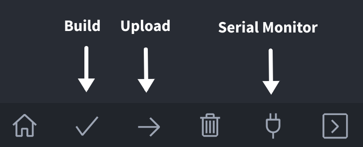

# ZotBins Core

ZotBins Core is a IoT Smart Bin to keep track of waste data metrics like bin fullness, weight, usage rates, etc. This is intended to help quantify waste data and promote solutions to reduce the amount of waste people throw away.

The previous iteration was a Raspberry Pi-based system. This system is intended to a replacement for the Raspberry Pi system, while being more reliable, maintainable, efficient, and testable.

## Prerequisites

- [Visual Studio Code](https://code.visualstudio.com/)
- [PlatformIO](https://platformio.org/), a cross-platform VSCode-based IDE for embedded system development
- [ESP-IDF](https://idf.espressif.com) (OPTIONAL alternative to PlatformIO) development framework for ESP devices, which also includes a VSCode extension - Version 5.3.1
- [CP210x USB to UART Bridge VCP Driver](https://www.silabs.com/developers/usb-to-uart-bridge-vcp-drivers), only needed if drivers are not already installed

## How to Build & Upload w/ PlatformIO

1. First, clone the repository using the command
```bash
git clone git@github.com:zotbins/ZotbinsCore.git
```

2. Create an `.env` file in the project directory following `.env.txt` as a template.

3. Fill in the values in `.env` with the appropriate values.



4. Build the project by clicking on `Build` ✔️ in the PlatformIO Toolbar, located in the left corner.

5. Upload the application by clicking on `Upload` ➡️ in the PlatformIO Toolbar.

6. Verify that the application was successfully uploaded by clicking on the `Serial Monitor` 🔌 for logs.
