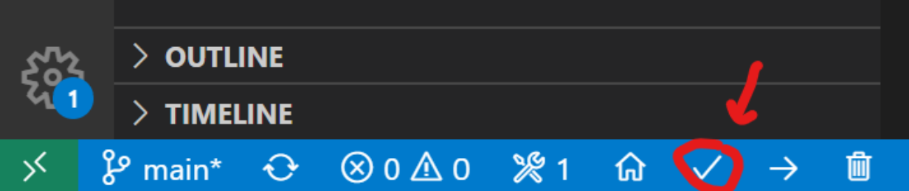
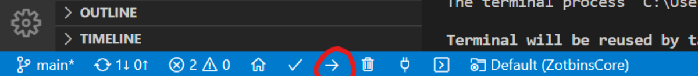
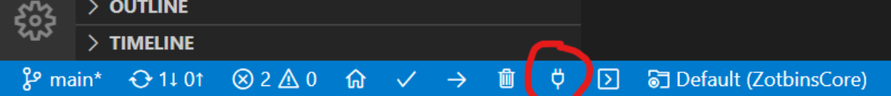

# ZotBins Core

## Prerequisites
- [Visual Studio Code](https://code.visualstudio.com/)
- [PlatformIO](https://platformio.org/), a cross-platform VSCode-based IDE for embedded system development

## Compiling and Uploading the Code
1. First, clone the repository using the command
```bash
git clone git@github.com:zotbins/ZotbinsCore.git
```

2. Create an `.env` file in the project directory following `.env.txt` as a template.

3. Fill in the values in `.env` with the appropriate values

3. Build the project by clicking on the ```Build``` button in the PlatformIO tab in VSCode.


4. Upload the application by clicking on the ```Upload``` Button in the PlatformIO tab.


5. Verify that the application was successfully uploaded by checking the ```Serial Monitor``` for logs
