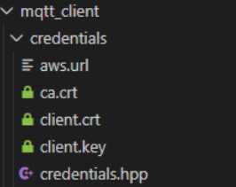

# ZotBins Communication Documentation 
This document includes all of the relevant information when it comes to the different device-device or device-server communication systems.

In the future this will be update with how we handle connectivity and some hardware we use to boost communication abilities. 

## AWS MQTT
### Server Credentials
In order for a client (ESP32 microcontroller) to interact with the server, it needs the correct credentials. The four main credentials are the following:

- **aws.url** - Contains the MQTT broker endpoint address
- **ca.crt (Certificate Authority Certificate)** - The root CA certificate used to verify the authenticity of the AWS server, ensuring you are connecting to a legitimate AWS endpoint
- **client.crt (Client Certificate)** - your device's unique public certificate that identifies and authenticates your specific device to the AWS server
- **Client.key (Client Private Key)** -the private key corresponding to your client certificate. That proves your device actually owns the client certificate and enables encrypted communication.

**Note:** In general, none of these credentials should be shared. They are a part of the.gitignore in ZotBinsCore. If you do not have the credentials or need a new policy message on the embedded channel, ping @chad on discord. Once you have the four files, you should paste them into ZotbinsCore\components\mqtt_client\credentials.



**AWS Policies**
Each set of credentials is paired with a specific AWS policy. The AWS policy is a JSON document that defines what actions (permission) a client is allowed to perform when connected to the server. For example, device 1 and device 2 are able to connect and read from the server, but only device 1 is allowed to write to the server.

There are four main actions for the AWS IoT Core:

- **iot:Connect** - Allows a device to establish to an MQTT connection to the AWS IoT broker 
- **iot:Publish** - Allows a device to send (publish) messages to specific MQTT topics
- **iot:Subscribe** -  Allows a device to register in (subscribe) to specific MQTT topics
- **iot:Receive** - Allows a device to actually receive/download message from topics it has subscribed to.

An example AWS policy (this is not the actual ZotBin policy):
```json
