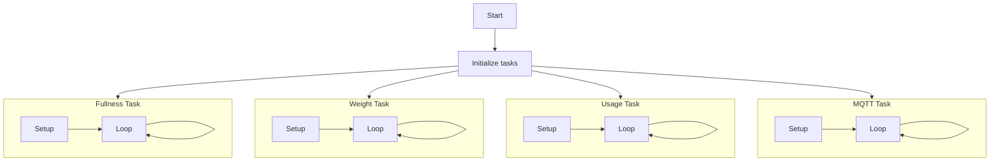
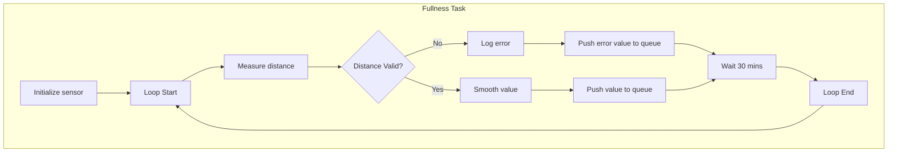

# ZotBins Core Software Architecture

# Introduction
The purpose of this document is to provide a detailed overview of the software architecture behind the new ZotBins Core, focusing on reliability, maintainability, and efficiency.

The intention of this document is to help the embedded system development team understand how the system is structured.

# Background
ZotBins Core is a IoT Smart Bin to keep track of waste data metrics like bin fullness, weight, usage rates, etc. This is intended to help quantify waste data and promote solutions to reduce the amount of waste people throw away.

The previous iteration was a Raspberry Pi-based system. This system is intended to a replacement for the Raspberry Pi system, while being more reliable, maintainable, efficient, and testable.

# Functional Requirements
Many of the features revolve around the various sensors that the ZotBins Core utilize.

- Breakbeam Sensor: Measure the amount of time a bin is used in a 30 minute time period
- Load Cell & HX-711: Measure the weight of the trash currently in the bin
- Ultrasonic sensor: Measure the current fullness of the trash can

Additionally, the system must publish the sensor data to a MQTT broker every 30 minutes.

# Architecture Overview
ZotBins Core is a RTOS application, where each function is divided into a separate task to optimize the efficiency and relability of the system. Each sensor has its own task and in the off chance the sensor fails, the overall system can still function as intended. 

Each sensor task will pass its sensor data to the MQTT task through a thread-safe queue, so the MQTT Task can publish its sensor data to the MQTT broker.

This system of having a task for each sensor makes the system more maintainable due to separation of concerns. The fullness task does not need to worry about the state of the weight task and can just focus on itself. In addition, the system is more extensible since a new task can be easily added to the system without interfering with the other features.

### Overall System Diagram (more detail on each task is shown down below)


## Fullness Task
The Fullness Task is responsible for measuring the current fullness of the waste bin. This is measured by the following equation. The height of the waste bin should be hard coded for each ZotBins Core deployment as each bin might differ in height.

```
Fullness % = (Height of Bin - Distance measured from ultrasonic sensor) / Height of Bin
```

The ultrasonic sensor can have a lot of noise, so [exponential smoothing](https://en.wikipedia.org/wiki/Exponential_smoothing) should be used to remove high-frequency noise. 

If the ultrasonic sensor reads an invalid value, it should log the error and return a error value like `-1` so the MQTT thread is not blocked waiting for the fullness value. 



## Weight Task
TODO

## Usage Task
TODO

## MQTT TASK
TODO
